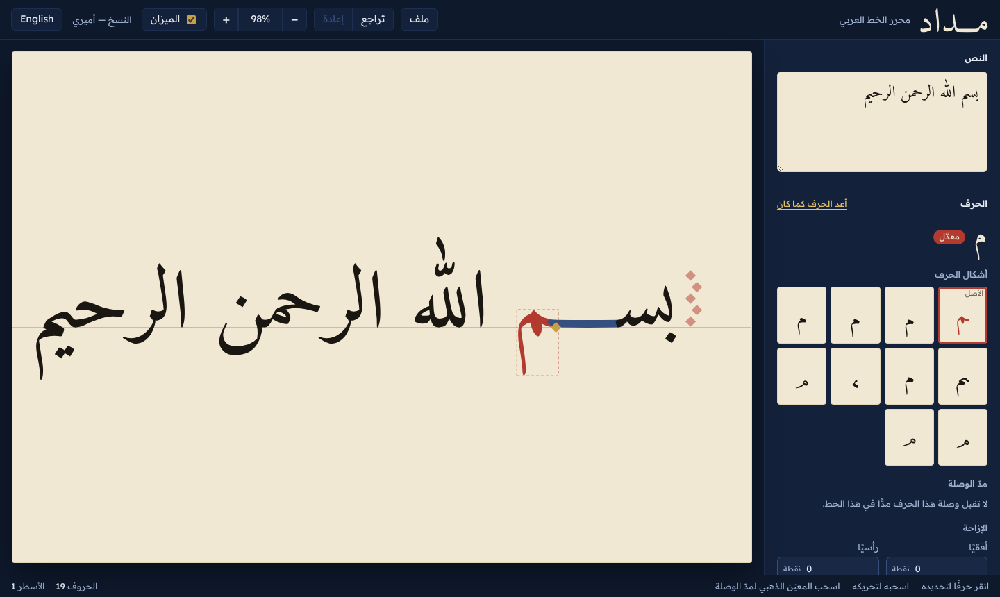

<div dir="rtl">

# مداد

**محرر مفتوح المصدر للخط العربي.** تكتب العبارة، فيرسمها المحرك بخط حقيقي،
ثم تختار لكل حرف شكله، وتمدّ الوصلات، وتحرّك الحروف وتكبّرها وتميلها،
وتصدّر النتيجة رسمًا متجهًا (SVG) أو صورة.

يعمل في المتصفح وعلى سطح المكتب (ويندوز، ماك، لينكس) بالكود نفسه.

</div>

# Midad

**An open-source editor for Arabic calligraphy.** Type a phrase, pick the
shape of every letter, stretch joins with kashida, move, scale and slant
letters, and export vector artwork. The same engine runs in the browser and
in the desktop app.



## What makes it different

* **A real shaping engine underneath.** Every frame is recomputed by
  [HarfRust](https://github.com/harfbuzz/harfrust) (the Rust port of HarfBuzz).
  Alternate shapes are applied *inside* the shaper, so harakat, kerning and
  joins are always positioned for the letter you see.
* **Documents store decisions, not drawings.** A `.midad` file is the text
  plus the calligrapher's choices. Edit the text and your choices follow.
* **Calligraphic units.** Offsets and elongations are shown in *nuqat*
  (rhombic pen dots), with the dot ladder drawn next to each line.
* **Styles are open data.** A style is an OFL font plus a `style.toml` that
  calligraphers can edit: options, kashida rules, alternates.

## Quick start

```bash
# prerequisites: Rust (stable), Node 20+, wasm-bindgen-cli 0.2.129
cargo install wasm-bindgen-cli --version 0.2.129 --locked
npm ci
npm run build:wasm
npm run dev            # → http://localhost:5173
```

Desktop: `npm run desktop:dev` (needs the [Tauri prerequisites](https://tauri.app/start/prerequisites/)).

Command line:

```bash
cargo run -p midad-cli -- render -s styles/naskh-amiri -t "بسم الله الرحمن الرحيم" -o basmala.svg
```

## Repository

| Path | |
|---|---|
| `crates/midad-core` | The engine (Rust): shaping, alternates, kashida, documents, SVG export |
| `crates/midad-wasm` | WebAssembly bindings |
| `crates/midad-cli` | `midad` command-line tool |
| `apps/web` | Editor UI (React + TypeScript + Vite) |
| `apps/desktop` | Desktop app (Tauri 2) |
| `styles/` | Style packages (`naskh-amiri`) |
| `tools/` | Style compiler (Python + fontTools) |
| `docs/` | Documentation |

## Documentation

* [Architecture](docs/ARCHITECTURE.md) — how the engine works and why
* [Development](docs/DEVELOPMENT.md) — setup, commands, testing, releases
* [Style packages](docs/STYLE_FORMAT.md) — `style.toml` reference, adding a style
* [Document format](docs/DOCUMENT_FORMAT.md) — the `.midad` file
* [Roadmap](docs/ROADMAP.md) — milestones and known limitations
* [Contributing](CONTRIBUTING.md) · [دليل الخطاطين](docs/ar/CALLIGRAPHERS.md)

## License

* Code: **MIT OR Apache-2.0**, at your option ([LICENSE-MIT](LICENSE-MIT), [LICENSE-APACHE](LICENSE-APACHE)).
* Fonts in `styles/`: **SIL Open Font License 1.1** (see each style's `OFL.txt`).
  The Naskh style is built on [Amiri](https://github.com/aliftype/amiri) by
  Khaled Hosny and Sebastian Kosch.
* **Your artwork is yours.** Anything you compose and export with Midad
  belongs to you, with no obligation of any kind — the OFL explicitly allows
  using the fonts in documents and images.
